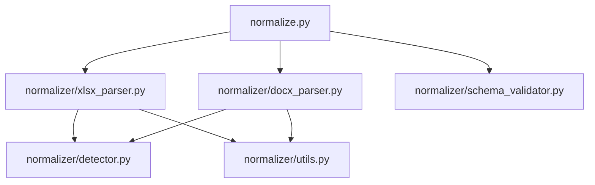

# Code Walkthrough: Security Questionnaire Normalizer

This document explains the role, design decisions, and detailed logic of each file and module in the Security Questionnaire Normalizer tool.

---

## Codebase Architecture Overview

The codebase is structured as a modular Python package. Here is the dependency and data flow diagram:

---

## 1. CLI Entry Point: `normalize.py`

- **Purpose**: Acts as the command-line interface (CLI) entry point.
- **Key Functions**:
  - `main()`: Parses terminal arguments (input file, output path, formatting flags, and post-parsing validation option).
  - Routes parsing to either `parse_xlsx` or `parse_docx` based on the file extension.
  - Adds top-level metadata (`source_file`, `questionnaire_name`, `version`) to match the final output schema requirements.
  - Outputs the resulting JSON to standard output (stdout) or a designated file, with optional formatting (`--pretty`).

---

## 2. Shared Utilities: `normalizer/utils.py`

- **Purpose**: Houses text-cleaning functions and boilerplate generator functions.
- **Key Features**:
  - `clean_text(value)`: Coerces raw Excel/Word cell data (which may be numeric, float, `None`, or contain raw control characters) into normalized unicode string representations (`NFKC` normalization). It trims trailing spaces and removes multiple duplicate newlines or horizontal spacing.
  - `is_noise_row(text)`: Uses compiled regular expressions to match and discard instruction headers, copyright warnings, color-coding legends, and general metadata headers (e.g. *"Please answer all..."* or *"Step 1"*).
  - `make_question_id() / make_section_id()`: Generates sequential synthetic identifiers (like `SEC1-Q3`) when the input document lacks explicit alphanumeric question numbers.

---

## 3. Heuristic Engine: `normalizer/detector.py`

- **Purpose**: Detects questions, section names, response formats, and response options.
- **Key Logic**:
  - **Question Classifier (`is_question`)**: A cell or text block is classified as a question if it ends with `?`, starts with a code matching `ID_PATTERNS` (e.g., `AC-01`, `3.1.2`, `Q5`), or contains common question-starting verbs (e.g., *Do you*, *Describe*, *Does your*, *Is there*).
  - **Framework Decoders (`resolve_section_name`)**: Maps abbreviations (like `AIS`, `IAM`, `BCDR`, `DCTR`) back to their full regulatory names (e.g. `"Identity and Access Management"`).
  - **Response Format & Options Classifier (`detect_response_type`)**:
    - Analyzes context cells adjacent to the question text.
    - If it matches yes/no/na variations, it identifies it as `"yes_no"` with corresponding option lists.
    - If options start with multiple-choice indicators (e.g., `A) ...`, `[ ] ...`, `1. ...`), it maps it as `"multiple_choice"`.
    - Handles raw comma or slash-separated choices.
    - Falls back to `"free_text"` if no choice lists are detected.

---

## 4. Excel Parser: `normalizer/xlsx_parser.py`

- **Purpose**: Parses `.xlsx` workbooks of varying layouts.
- **Key Logic**:
  - **Sheet Selection**: Filters sheets using blocklists (ignoring `Instruction`, `Changelog`, `Guiding Principles` etc.). If `Standards Crosswalk` exists, it isolates that sheet.
  - **Merged Cells Propagation (`_build_merge_map` & `_flatten_rows`)**: Uses an optimized coordinate mapping to find merged cells. By using internal storage `sheet._cells.get` and `iter_rows(values_only=True)`, it avoids instantiating slow cell objects, accelerating parsing of large files.
  - **Dynamic Layout Detection**:
    - Scans the first 30 rows of the sheet.
    - Inspects all columns to see if one matches the Question ID pattern. If multiple match, it selects the most specific one to be `id_col_idx` (e.g., preferring `AIS-01.1` over `AIS-01`).
    - Automatically finds the most likely Question Text column (`q_col_idx`) on the same row.
  - **Inline & Group Sectioning**:
    - Recognizes standard empty-row headers.
    - Additionally, supports inline sections (like CAIQ v3.1), where the section title is written in Column A of the first row of a group. It monitors Column A for changes and automatically starts a new section whenever the text changes.

---

## 5. Word Parser: `normalizer/docx_parser.py`

- **Purpose**: Iterates through Word documents (`.docx`) to extract questions.
- **Key Logic**:
  - **Document Ordering (`_iter_body_elements`)**: Python-docx separates paragraphs and tables into distinct lists. We walk the document's underlying XML tree (`doc.element.body`) to yield elements in their true visual order.
  - **Paragraph Parsing**: Classifies individual text lines as metadata, section headers, or standalone questions.
  - **Table Parsing (`_parse_table`)**:
    - Analyzes rows inside tables.
    - Column 0 is treated as the primary candidate (either Section Header or Question Text).
    - Columns 1 and onward are gathered as response format context (looking for multiple-choice options or checkboxes).

---

## 6. Output Validator: `normalizer/schema_validator.py`

- **Purpose**: Assures program outputs are correct and compliant.
- **Key Logic**:
  - Loads the JSON schema defined in `schema/output_schema.json`.
  - Runs the draft7 JSON validation suite on the provided JSON file.
  - Prints `VALID` on success, or a detailed validation trace/error list on failure.
